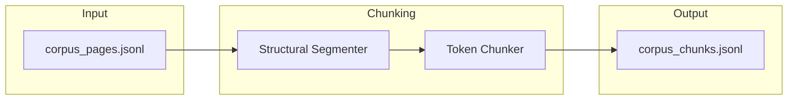

# Chunking Pipeline

Structured pages → retrieval-optimized chunks.



## Strategy

1. **Structural segmentation** — Split by sections, articles, paragraphs
2. **Token chunking** — Respect model context limits (overlap, max tokens)

## Script

```bash
python scripts/run_chunking.py
```

## Output Format

Each chunk: `chunk_id`, `document_id`, `page_number`, `section_title`, `text`, `token_count`
