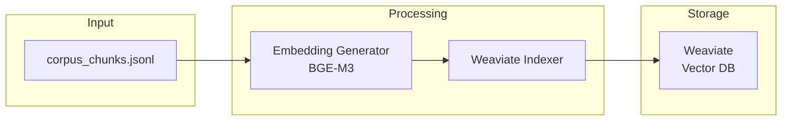

# Embedding and Indexing Pipeline

Chunks → vectors → Weaviate.



## Scripts

```bash
python scripts/init_weaviate.py   # Create collection schema
python scripts/run_indexing.py    # Embed and index chunks
```

## Single Command

```bash
python scripts/run_pipeline.py    # Full pipeline: ingestion → chunking → init → indexing
```
