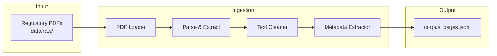

# Ingestion Pipeline

PDF documents → structured pages with metadata.



## Script

```bash
python scripts/run_ingestion.py
```

## Output Format

Each line in `corpus_pages.jsonl`:

- `document_id`, `page_number`, `text`, `metadata`
