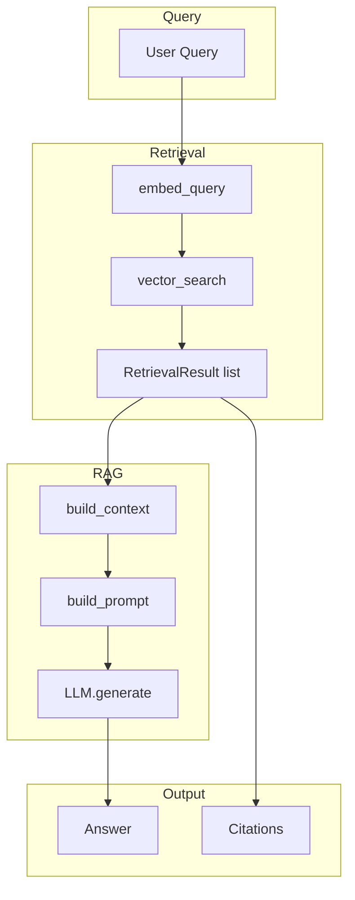

# Retrieval and RAG Pipeline

Query → retrieval → context → prompt → LLM → response.

## Flow

1. **embed_query** — Encode query with BGE-M3
2. **vector_search** — Top-K similarity in Weaviate
3. **build_context** — Assemble chunks (token limit, max chunks)
4. **build_prompt** — Structured prompt with system instruction + context + query
5. **LLM.generate** — Ollama completion
6. **Citations** — Derived from `(document_id, page_number)` of retrieved chunks

## Modules

- `src.retrieval.retriever` — `retrieve(query, top_k)`
- `src.rag.rag_pipeline` — `answer_query(query, llm, top_k)`
- `src.rag.prompt_template` — `build_prompt(context, query)`
