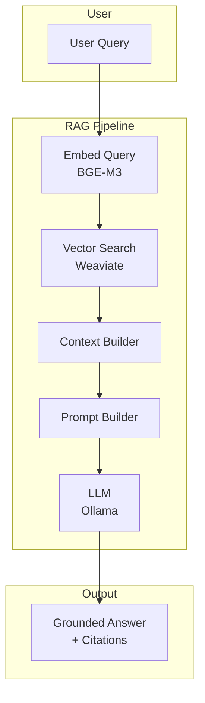

# System Overview

High-level flow from user query to grounded response.

## Components

| Step | Module | Description |
|------|--------|-------------|
| Embed | `retrieval.query_embedding` | Encode query with BGE-M3 |
| Search | `retrieval.vector_search` | Top-K similarity search in Weaviate |
| Context | `rag.context_builder` | Assemble chunks with token limit |
| Prompt | `rag.prompt_template` | Build structured prompt with context |
| LLM | `llm.baseline_llm` | Generate response via Ollama |
